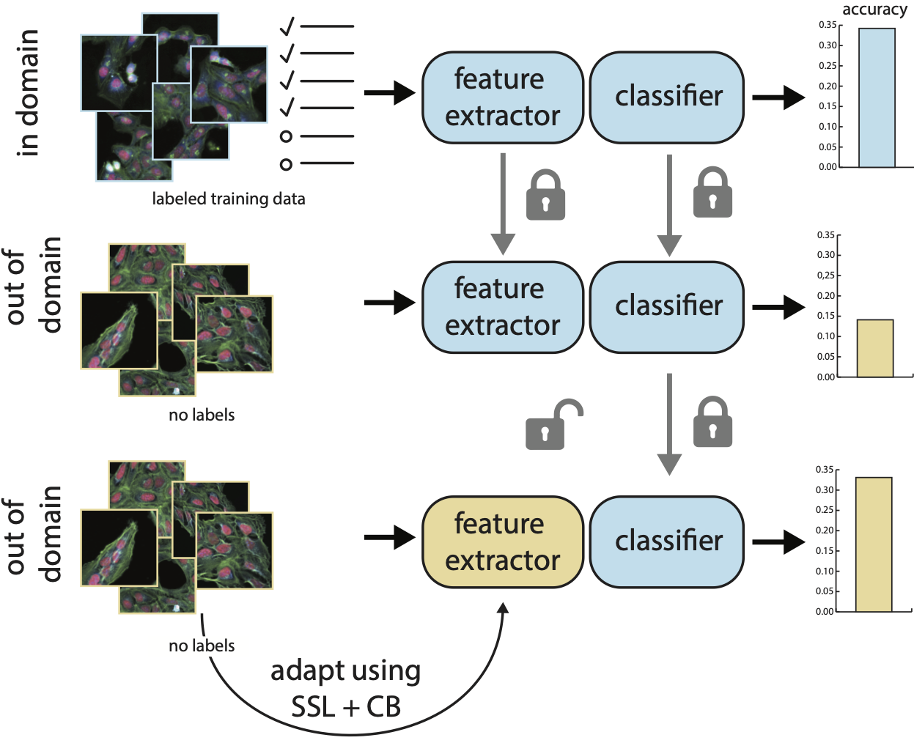

# Bridging Generalization Gaps in High Content Imaging Through Online Self-Supervised Domain Adaptation


Codebase for the paper [*"Bridging Generalization Gaps in High Content Imaging Through Online Self-Supervised Domain Adaptation"*](https://arxiv.org/abs/2311.12623), originally published at **WACV 2024**.


<p align="center">
  
</p>

#### Abstract:

High Content Imaging (HCI) plays a vital role in modern drug discovery and development pipelines, facilitating various stages from hit identification to candidate drug characterization. 
Applying machine learning models to these datasets can prove challenging as they typically consist of multiple batches, affected by experimental variation, especially if different imaging equipment have been used.
Moreover, as new data arrive, it is preferable that they are analyzed in an online fashion.
To overcome this, we propose CODA, an online self-supervised domain adaptation approach.
CODA divides the classifier's role into a generic feature extractor and a task-specific model. 
We adapt the feature extractor's weights to the new domain using cross-batch self-supervision while keeping the task-specific model unchanged.
Our results demonstrate that this strategy significantly reduces the generalization gap, achieving up to a 300\% improvement when applied to data from different labs utilizing different microscopes. 
CODA can be applied to new, unlabeled out-of-domain data sources of different sizes, from a single plate to multiple experimental batches.


## Data

In this study we used data from the [JUMP-CP consoritum](https://jump-cellpainting.broadinstitute.org). 
The data is availble for download from the Cell Painting Gallery data storage on [AWS](https://registry.opendata.aws/cellpainting-gallery/). The data comes from the Target-2 plates in CPG0016, see https://github.com/broadinstitute/cellpainting-gallery for more info about the data.

### Pre-processing

Pre-process the data can be done using [Deep Profiler](https://github.com/cytomining/DeepProfiler).

Mechanism of Action data can be found at Repurposing hub at https://www.broadinstitute.org/drug-repurposing-hub


## Models

### Training

The models can be trained using dino by the following command: 

```python classification.py --params_path params/settings/self-supervised-coda-step-1.json --dino```

Followed by training of the classification model:

```python classification.py --params_path params/settings/classifier-training-coda-step-2.json --oda```

### Aligment

The models can be aligned to a new source using self-supervision by the following command: 

```python classification.py --params_path params/settings/self-supervised-OOD-coda-step-3.json --dino --ssl_oda```

### Inference

The trained models can be run on any subset of data by the following command: 
```python classification.py --params_path params/settings/inference-OOD-coda-step-4.json --test --oda```

## Citation
To cite our work please use the following BibTeX entry:

```markdown
@inproceedings{haslum2024bridging,
  title={Bridging Generalization Gaps in High Content Imaging Through Online Self-Supervised Domain Adaptation},
  author={Haslum, Johan Fredin and Matsoukas, Christos and Leuchowius, Karl-Johan and Smith, Kevin},
  booktitle={Proceedings of the IEEE/CVF Winter Conference on Applications of Computer Vision},
  pages={7738--7747},
  year={2024}
}
```
